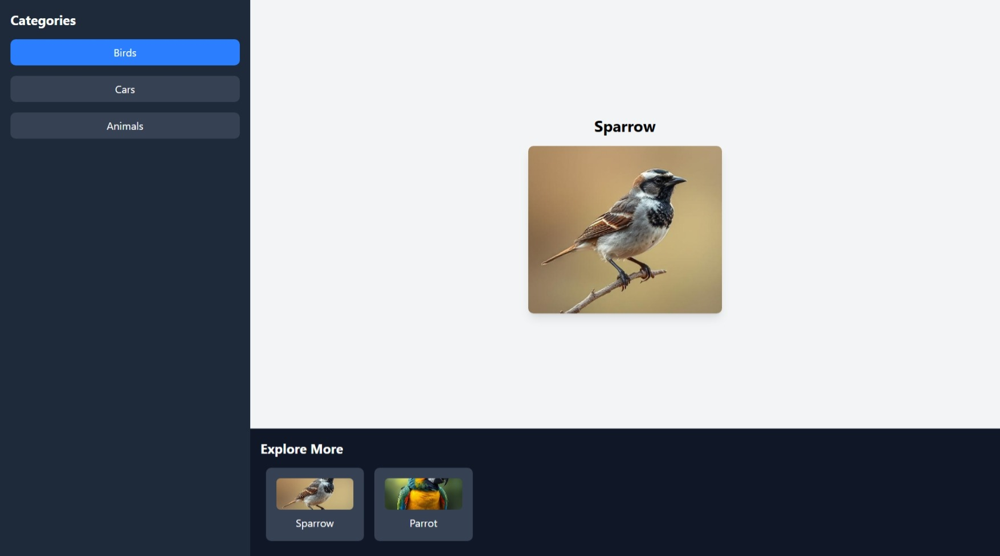

# 🧠 LearnAndView

A responsive and interactive educational content viewer built using **React**, **Tailwind CSS**, and **Bun** runtime. This project displays categorized content like (Birds, Cars etc) with image previews and a clean UI for quick exploration and learning.

---

## ✨ Features

- 🔍 **Category Sidebar**: Instantly switch between category.
- 🖼️ **Dynamic Display**: Shows selected category content with image and title.
- 📚 **Explore More Section**: Provides thumbnails for related content.
- 💡 **Modern Tech Stack**: Uses React + Tailwind CSS with Bun for blazing-fast development.

---

## 🧱 Tech Stack

| Tech        | Usage                                    |
| ----------- | ---------------------------------------- |
| 🧠 React    | Frontend UI rendering                    |
| 🎨 Tailwind | CSS utility classes for design           |
| ⚡ Bun      | Runtime & package manager                |
| 📂 Vite     | Frontend build tool (configured via Bun) |

---

## 📁 Project Structure

- public/ – Contains static assets used by the app

  - ss.jpeg – Interface screenshot used in documentation
  - car.png – Image asset representing the "Car" category

- src/ – Main source folder for React components and assets

  - assets/

    - img/ – Image directory
    - components/ – Modular React components
      - ChildGameGroup.jsx – Component
      - Display.jsx – Renders dynamic content based on category
      - ProFooter.jsx – Footer layout for the application
      - Sidebar.jsx – Sidebar for selecting content groups

  - App.css – Custom styles specific to the App component

  - App.jsx – Root React component that wraps all views

  - index.css – Tailwind CSS base and utility styling

  - main.jsx – Application entry point (mounts React on DOM)

Config & Meta Files

- .gitignore – Files/folders to exclude from version control

- bun.lock – Dependency lockfile generated by Bun

- eslint.config.js – Linting rules and standards

- index.html – HTML template used by Vite

- package.json – Project metadata and dependencies

- vite.config.js – Vite build tool configuration

## 📸 Preview



---

## 🚀 Getting Started

### 📦 Installation

```bash
git clone https://github.com/Devkacha03/MusicPlayer.git
cd MusicPlayer/music-player
bun install
bun run dev
```
